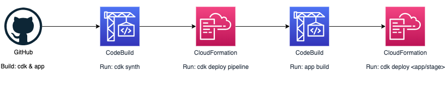

# How to Run

> This is CDKPipline (CDKPiepline Flow)



You can find the environment reference in [here][Environments] and [here][Environment variables in build environments]

&thinsp;

1. Create `export-variables` file with `export-variables.example` file content in root directory && change some params

2. Create `.env` file with `.env.example` file content in cdk directory && change some params

3. set local param in current windows

    ```properties
    $ source export-variables
    ```

4. Create SSM Param in AWS

    ```properties
    $ bash ssm-put-parameters.sh
    ```

5. Entry `cdk` directory && Install the Package

    ```properties
    $ npm i
    ```

6. List all Stacks

    ```properties
    $ cdk ls
    ```

7. Deploy to AWS

    ```properties
    $ cdk deploy Cicd-CDKPipeline-Dev-PipelineStack
    ```

After the Stack has been deployed, go to the AWS console `CodePiepline` Service Page, Until the Pipeline done

Go to the `cloudformation` Service Page and Click Output, you can get the load balancer url in the page, then browse the link.

Or you can go to the `ec2` Service Page Click the Application Load balander in the menu, then copy the url and browse the link.


<!-- Reference -->

[Environments]: https://docs.aws.amazon.com/cdk/latest/guide/environments.html
[Environment variables in build environments]: https://docs.aws.amazon.com/codebuild/latest/userguide/build-env-ref-env-vars.html
